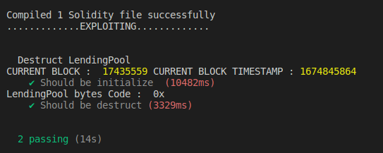

# Attack to Moola
The bug in the LendingPool implementation contract, known as the Moola protocol, is that it hasn't been properly initialized in the logic contract. This means that anyone can call the initialize function and set the address provider. Additionally, the Moola protocol uses the delegatecall function in the liquidationCall function, which can potentially lead to a security vulnerability if the selfdestruct function is used. This could result in the destruction of the logic contract and the freezing of all funds in the Moola protocol, causing the protocol to not function correctly. Furthermore, all funds in the AToken contract would also be frozen, as the lending pool would no longer have access to mint, burn or transfer. The specific contract affected by this vulnerability is 0xb9F812003aE906d381945E6010614c114Ecf1A59 on Celo network, which is the LendingPoolImpl contract.


## Try running some of the following tasks:

```shell
1. npx ganache-cli --fork https://celo-mainnet.infura.io/v3/b2f8bba4d15e490692c7448a169048a1

2. npx hardhat run --network hardhat scripts/deploy.js

3. Replace destruct address contract in attack.sol file

4. npx hardhat test
```

### After hardhat run we get address of Destruct contract 


### Finally test contract

