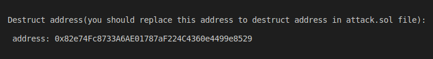

# Attack to Moola

This project for attack to Moola protocol, The Moola protocol hasn't  initialized in logic contract and every one can call initialize and set address provider, Moola use delegatecall in liquidationCall function, If  we use self destruct function in delegatecall, logic contract will be destruct and all funds in the Moola protocol will be frozen and protocol not working correctly.  


Address logic contract is "0xb9F812003aE906d381945E6010614c114Ecf1A59" on Celo network.

## Try running some of the following tasks:

```shell
1. npx ganache-cli --fork https://celo-mainnet.infura.io/v3/b2f8bba4d15e490692c7448a169048a1

2. npx hardhat run --network hardhat scripts/deploy.js

3. Replace destruct address contract in attack.sol file

4. npx hardhat test
```

### After hardhat run we get address of Destruct contract 



### Finally test contract

